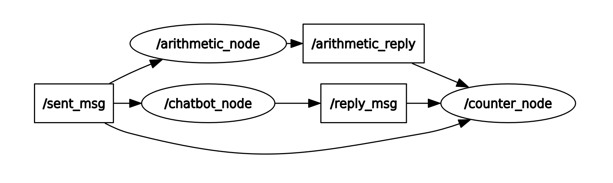

# 1. Briefly explain how services in ROS work.

ROS services are a request-response type of communication. One node - the client - uses a data structure defined by a .srv file to place a request to the server node, which performs some sort of operation whose result can be accessed by the client, while also returning if the operation was successful or not.

# 2. Include a ROS node graph of your nodes.

# 3. Do you think the assignment was helpful for you to get started in ROS?

I can't really answer. I have been using ROS for a while now... 

# 4. Was the assignment difficulty manageable?

Yes, but this assignment needs to be updated ASAP. The CMakeFiles have some problems when used with newer versions of ROS and I had to change some configurations in the GUI to stop the arithmetic node and the chatbot node from overlapping incorrectly. Also, considering the EOL for ROS1, newer assignments should focus on ROS2.